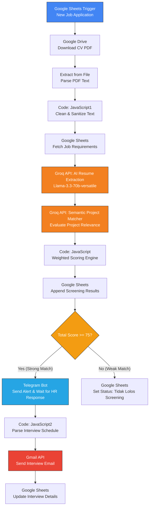

# AI Recruitment CV Screening Workflow (n8n)

An end-to-end automated **AI-Powered CV Screening & Recruitment Workflow** built on **n8n**. This project automates the entire candidate evaluation pipeline: from catching new job application submissions in Google Sheets, parsing and analyzing CV documents using LLMs (Groq Llama 3.3 70B), calculating multi-factor deterministic match scores, interacting with recruiters via Telegram, to automatically sending personalized interview invitations via Gmail and updating database status.

---

## 🌟 Key Features

- **Automated CV Ingestion & Extraction**: Automatically triggers on new Google Form/Sheets submissions, downloads PDF resumes from Google Drive, and parses text cleanly.
- **Dual-Stage LLM Evaluation (Groq / Llama-3.3-70B)**:
  1. **Structured Data Extraction**: Converts unstructured CV text into JSON (Name, Email, Skills, Experience, Education Level, Projects Summary).
  2. **Semantic Project Matcher**: Evaluates past project experience against the Target Job Description with zero-shot semantic matching and generates a brief Indonesian justification note.
- **5-Factor Weighted Scoring Algorithm**:
  - 🛠️ **Skill Match (40%)**: Hard skills coverage ratio against job requirements.
  - 💼 **Experience Match (25%)**: Ratio of candidate's total years of experience vs. minimum required.
  - 🎓 **Education Level Match (10%)**: Hierarchical academic qualification comparison (High School < Diploma < Bachelor < Master < PhD).
  - 🚀 **Project Relevance (15%)**: LLM semantic score for project context match.
  - 🔑 **Keyword Match (10%)**: Exact-match frequency of critical domain keywords.
- **Human-in-the-Loop Interactivity (Telegram Bot)**:
  - Candidates scoring $\ge 75\%$ trigger a real-time Telegram notification to the recruiter.
  - Recruiters can reply directly in Telegram with the interview schedule (`Tanggal | Jam | Link Meeting`).
- **Automated Scheduling & Communication**:
  - Automatically sends styled HTML interview invitation emails to qualified candidates via Gmail.
  - Logs candidate status, score breakdown, evaluation reasons, and interview details back to Google Sheets.

---

## 📊 Evaluation & Scoring Model

The workflow uses a hybrid evaluation system combining **LLM semantic reasoning** and **deterministic math rules**:

$$\text{Total Score} = (\text{Skill} \times 0.40) + (\text{Exp} \times 0.25) + (\text{Edu} \times 0.10) + (\text{Project} \times 0.15) + (\text{Keyword} \times 0.10)$$

| Dimension | Weight | Calculation Method |
| :--- | :---: | :--- |
| **Skill Match** | **40%** | $\frac{\text{Matched Required Skills}}{\text{Total Required Skills}} \times 100$ |
| **Experience** | **25%** | $\min\left(100, \frac{\text{Candidate Exp Years}}{\text{Min Exp Years}} \times 100\right)$ |
| **Education** | **10%** | Standardized hierarchy level comparison. $100\%$ if $\ge$ required level. |
| **Project Relevance** | **15%** | Groq Llama-3.3-70B semantic similarity rating ($0-100$). |
| **Keywords** | **10%** | Keyword hits in raw CV text divided by target keywords count. |

> **Threshold**: Score $\ge 75$ = `Strong Match` (Triggers Telegram & HR Approval Flow). Score $< 75$ = `Weak Match` (Marked as "Tidak Lolos Screening").

---

## 🔄 Workflow Architecture & Node Flow



---

## 🛠️ Tech Stack & Integrations

- **Orchestration**: [n8n](https://n8n.io/)
- **AI Model**: [Groq API](https://groq.com/) (Model: `llama-3.3-70b-versatile`)
- **Database & Trigger**: Google Sheets API & Google Drive API
- **Messaging & Human Input**: Telegram Bot API (`sendAndWait` node)
- **Email Communications**: Gmail API

---

## 🚀 Setup & Installation

### 1. Prerequisites
- Running n8n instance (Self-hosted or Cloud).
- API Keys & Credentials:
  - **Groq API Key** (Header Auth: `Authorization: Bearer <YOUR_GROQ_API_KEY>`)
  - **Google Cloud OAuth2 Credential** (Scoped for Sheets, Drive, and Gmail)
  - **Telegram Bot Token** & Chat ID

### 2. Google Sheets Setup
Ensure your Google Sheets contains the following sheets/tabs:
1. **Form Responses 1**: Trigger sheet where candidates apply (Columns: `Nama Lengkap`, `Email`, `Posisi yang di lamar`, `Upload CV`, `Job_ID`).
2. **Job_Requirements**: Master job specs (Columns: `Job_ID`, `Job_Title`, `Job_Summary`, `Required_Skills`, `Min_Experience_Years`, `Min_Education`, `Keywords`).
3. **Sheet2**: Output sheet for candidate evaluation results (Columns: `Candidate_Name`, `Email`, `Job_ID`, `Total_Score`, `Skill_Score`, `Exp_Score`, `Edu_Score`, `Project_Score`, `Keyword_Score`, `Status`, `Skills_Found`, `Interview`).

### 3. Importing the Workflow into n8n
1. Open your n8n Dashboard.
2. Click **Workflows** > **Add Workflow** > **Import from File / Paste JSON**.
3. Copy and paste the project JSON workflow content.
4. Re-bind your credential accounts for:
   - Google Sheets Trigger Account
   - Google Sheets OAuth2 API
   - Google Drive OAuth2 API
   - Header Auth Account (Groq API Key)
   - Telegram API
   - Gmail OAuth2

---

## 💬 Recruiter Interaction Format (Telegram)

When a candidate scores 75 or higher, the Telegram bot sends a message containing candidate details and waits for the recruiter's reply. 

**Format expected from Recruiter:**
```text
Tanggal | Jam | Link Meeting
```

**Example Reply:**
```text
15 Agustus 2026 | 10:00 WIB | https://meet.google.com/abc-defg-hij
```

The workflow parses this pipe-separated response and automatically formats the Gmail invitation sent to the applicant.

---

## 📄 License

This project is open-source under the [MIT License](LICENSE).