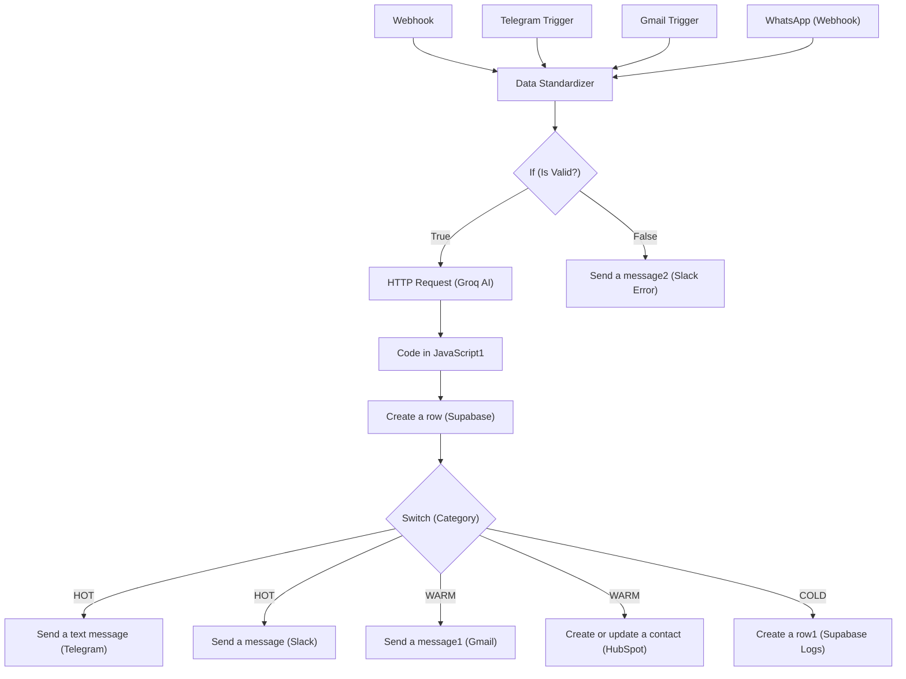

# AI Lead Qualification & Sales Automation (n8n)

## Deskripsi singkat

Workflow n8n untuk menerima lead dari berbagai channel (webhook, Telegram, Gmail), melakukan normalisasi dan validasi data, memanggil LLM untuk scoring dan ringkasan, menyimpan lead ke Supabase, serta mengirim notifikasi ke tim Sales (Slack/Telegram) dan CRM (HubSpot).

## Project Workflow


## Fitur utama

- Mengambil lead dari Webhook / Telegram / Gmail
- Normalisasi dan validasi data (email, telepon)
- Pemanggilan LLM (Groq) untuk scoring & ringkasan lead
- Penyimpanan otomatis ke Supabase
- Notifikasi otomatis ke Slack / Telegram dan integrasi HubSpot

## Persyaratan

- n8n (self-hosted atau n8n.cloud)
- Groq API key (model yang digunakan: `llama-3.3-70b-versatile`)
- Supabase (URL + service_role/service key)
- Slack OAuth2 (untuk notifikasi)
- Gmail OAuth2 (opsional, untuk trigger atau pengiriman email)
- Telegram bot token (opsional)
- HubSpot API key (opsional)
- Public webhook endpoint (atau tunnel seperti ngrok jika self-hosted)

## Instalasi & Import

1. Buka n8n → Workflows → Add → Import from File.
2. Pilih file: `AI Lead Qualification & Sales Automation.json` dari folder `Lead-Qualification-Sales`.
3. Re-bind semua credential pada setiap node (Groq, Supabase, Slack, Gmail, Telegram, HubSpot).
4. Setelah credential terpasang, aktifkan workflow.

## Konfigurasi

Set credential dan environment berikut di n8n atau deployment Anda:

- `GROQ_API_KEY` — header bearer untuk node HTTP Request ke Groq
- `SUPABASE_URL`, `SUPABASE_KEY` — untuk membuat row ke tabel `leads`
- `SLACK_OAUTH` — token OAuth untuk notifikasi Slack
- `GMAIL_OAUTH` — credential Gmail (jika digunakan)
- `TELEGRAM_TOKEN` — bot token untuk notifikasi/trigger Telegram
- `HUBSPOT_API_KEY` — untuk integrasi HubSpot (opsional)
- Pastikan webhook node menunjukkan URL yang benar setelah import (gunakan URL itu untuk mengirim payload dari form/CRM).

## Alur Kerja Singkat

1. Trigger menerima payload (Webhook / Telegram / Gmail).
2. Node `Data Standardizer` membersihkan dan memvalidasi input (email, telepon).
3. Jika valid, kirimkan teks/payload ke Groq (LLM) untuk scoring dan summary.
4. Parse hasil LLM, buat row di Supabase dan simpan log qualification.
5. Berdasarkan kategori (HOT / WARM / COLD) alihkan notifikasi dan tindakan: kirim Slack/Telegram, kirim email, atau buat contact di HubSpot.

## Diagram Arsitektur (Mermaid)

```mermaid
flowchart LR
  subgraph Triggers
    WH[Webhook]
    TG[Telegram Trigger]
    GM[Gmail Trigger]
    WA[WhatsApp Webhook]
  end

  WH --> DS[Data Standardizer]
  TG --> DS
  GM --> DS
  WA --> DS

  DS --> IF{If valid}
  IF -- true --> HR[HTTP Request (Groq)]
  IF -- false --> SL2[Send a message2 (Slack) / error flow]

  HR --> CJ[Code in JavaScript]
  CJ --> SB[Create a row (Supabase)]
  SB --> SW[Switch (HOT/WARM/COLD)]

  SW --> TLG[Send a text message (Telegram)]
  SW --> SL[Send a message (Slack)]
  SW --> GMS[Send a message1 (Gmail) & HubSpot]
  SW --> LOG[Create a row1 (Supabase logs)]
```

## Node & Credential Mapping

- `Telegram Trigger` : `telegramApi` — example credential name: "Telegram account"
- `Send a text message` : `telegramApi` — "Telegram account"
- `HTTP Request` : `httpHeaderAuth` — "Header Auth account" (used for Groq API)
- `Create a row` / `Create a row1` : `supabaseApi` — "Supabase account"
- `Send a message` / `Send a message2` (Slack) : `slackOAuth2Api` — "Slack account"
- `Send a message1` (Gmail) / `Gmail Trigger` : `gmailOAuth2` — "Gmail account"
- `HubSpot` node: configure HubSpot credentials in n8n (not stored in JSON export snippet)

## Contoh Payload (untuk Webhook)

```json
{
  "name": "Budi Santoso",
  "email": "budi@example.com",
  "phone": "08123456789",
  "company": "PT Contoh",
  "message": "Kami tertarik dengan solusi automasi"
}
```

## Contoh Output (dari LLM)

```json
{
  "qualification_score": 87,
  "category": "HOT",
  "ai_summary": "Lead berniat implementasi Q4, budget tersedia",
  "recommended_action": "Follow-up oleh AE dalam 24 jam"
}
```

## Catatan Keamanan

- Jangan menyimpan API keys atau credential sensitif di dalam file JSON workflow. Gunakan credential manager n8n atau environment variables.
- Batasi hak akses kunci Supabase (gunakan role terbatas jika memungkinkan).

## File dalam folder

- `AI Lead Qualification & Sales Automation.json` — file workflow n8n
- `Readme.MD` — dokumentasi ini

## Lisensi

Default: MIT (sesuaikan jika perlu)
