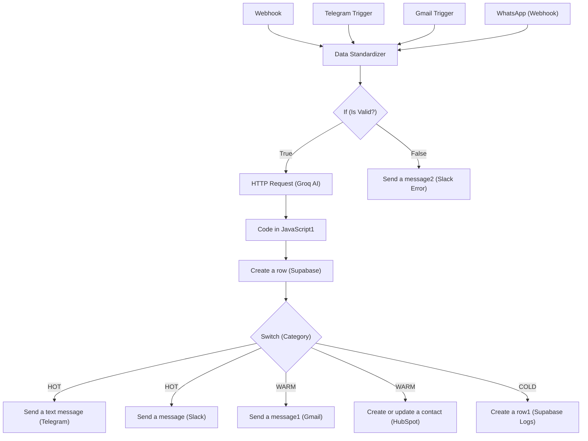
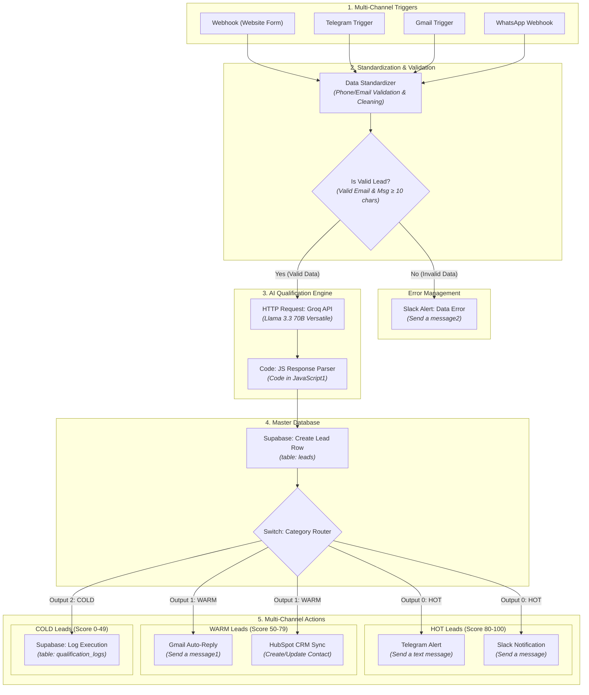

<<<<<<< HEAD
# AI Lead Qualification & Sales Automation (n8n)

## Deskripsi singkat

Workflow n8n untuk menerima lead dari berbagai channel (webhook, Telegram, Gmail), melakukan normalisasi dan validasi data, memanggil LLM untuk scoring dan ringkasan, menyimpan lead ke Supabase, serta mengirim notifikasi ke tim Sales (Slack/Telegram) dan CRM (HubSpot).

## Project Workflow


## Fitur utama

- Mengambil lead dari Webhook / Telegram / Gmail
- Normalisasi dan validasi data (email, telepon)
- Pemanggilan LLM (Groq) untuk scoring & ringkasan lead
- Penyimpanan otomatis ke Supabase
- Notifikasi otomatis ke Slack / Telegram dan integrasi HubSpot

## Persyaratan

- n8n (self-hosted atau n8n.cloud)
- Groq API key (model yang digunakan: `llama-3.3-70b-versatile`)
- Supabase (URL + service_role/service key)
- Slack OAuth2 (untuk notifikasi)
- Gmail OAuth2 (opsional, untuk trigger atau pengiriman email)
- Telegram bot token (opsional)
- HubSpot API key (opsional)
- Public webhook endpoint (atau tunnel seperti ngrok jika self-hosted)

## Instalasi & Import

1. Buka n8n → Workflows → Add → Import from File.
2. Pilih file: `AI Lead Qualification & Sales Automation.json` dari folder `Lead-Qualification-Sales`.
3. Re-bind semua credential pada setiap node (Groq, Supabase, Slack, Gmail, Telegram, HubSpot).
4. Setelah credential terpasang, aktifkan workflow.

## Konfigurasi

Set credential dan environment berikut di n8n atau deployment Anda:

- `GROQ_API_KEY` — header bearer untuk node HTTP Request ke Groq
- `SUPABASE_URL`, `SUPABASE_KEY` — untuk membuat row ke tabel `leads`
- `SLACK_OAUTH` — token OAuth untuk notifikasi Slack
- `GMAIL_OAUTH` — credential Gmail (jika digunakan)
- `TELEGRAM_TOKEN` — bot token untuk notifikasi/trigger Telegram
- `HUBSPOT_API_KEY` — untuk integrasi HubSpot (opsional)
- Pastikan webhook node menunjukkan URL yang benar setelah import (gunakan URL itu untuk mengirim payload dari form/CRM).

## Alur Kerja Singkat

1. Trigger menerima payload (Webhook / Telegram / Gmail).
2. Node `Data Standardizer` membersihkan dan memvalidasi input (email, telepon).
3. Jika valid, kirimkan teks/payload ke Groq (LLM) untuk scoring dan summary.
4. Parse hasil LLM, buat row di Supabase dan simpan log qualification.
5. Berdasarkan kategori (HOT / WARM / COLD) alihkan notifikasi dan tindakan: kirim Slack/Telegram, kirim email, atau buat contact di HubSpot.

## Diagram Arsitektur (Mermaid)

```mermaid
flowchart LR
  subgraph Triggers
    WH[Webhook]
    TG[Telegram Trigger]
    GM[Gmail Trigger]
    WA[WhatsApp Webhook]
  end

  WH --> DS[Data Standardizer]
  TG --> DS
  GM --> DS
  WA --> DS

  DS --> IF{If valid}
  IF -- true --> HR[HTTP Request (Groq)]
  IF -- false --> SL2[Send a message2 (Slack) / error flow]

  HR --> CJ[Code in JavaScript]
  CJ --> SB[Create a row (Supabase)]
  SB --> SW[Switch (HOT/WARM/COLD)]

  SW --> TLG[Send a text message (Telegram)]
  SW --> SL[Send a message (Slack)]
  SW --> GMS[Send a message1 (Gmail) & HubSpot]
  SW --> LOG[Create a row1 (Supabase logs)]
```

## Node & Credential Mapping

- `Telegram Trigger` : `telegramApi` — example credential name: "Telegram account"
- `Send a text message` : `telegramApi` — "Telegram account"
- `HTTP Request` : `httpHeaderAuth` — "Header Auth account" (used for Groq API)
- `Create a row` / `Create a row1` : `supabaseApi` — "Supabase account"
- `Send a message` / `Send a message2` (Slack) : `slackOAuth2Api` — "Slack account"
- `Send a message1` (Gmail) / `Gmail Trigger` : `gmailOAuth2` — "Gmail account"
- `HubSpot` node: configure HubSpot credentials in n8n (not stored in JSON export snippet)

## Contoh Payload (untuk Webhook)

```json
{
  "name": "Budi Santoso",
  "email": "budi@example.com",
  "phone": "08123456789",
  "company": "PT Contoh",
  "message": "Kami tertarik dengan solusi automasi"
}
```

## Contoh Output (dari LLM)

```json
{
  "qualification_score": 87,
  "category": "HOT",
  "ai_summary": "Lead berniat implementasi Q4, budget tersedia",
  "recommended_action": "Follow-up oleh AE dalam 24 jam"
}
```

## Catatan Keamanan

- Jangan menyimpan API keys atau credential sensitif di dalam file JSON workflow. Gunakan credential manager n8n atau environment variables.
- Batasi hak akses kunci Supabase (gunakan role terbatas jika memungkinkan).

## File dalam folder

- `AI Lead Qualification & Sales Automation.json` — file workflow n8n
- `Readme.MD` — dokumentasi ini

## Lisensi

Default: MIT (sesuaikan jika perlu)
=======
# AI Lead Qualification & Sales Automation Workflow

An intelligent, multi-channel automated lead qualification engine built on **n8n**, powered by **Groq API (Llama 3.3 70B)**, and integrated with **Supabase**, **HubSpot**, **Slack**, **Telegram**, and **Gmail**.

---

## 📌 Project Overview

This workflow automates the entire top-of-funnel lead intake and qualification pipeline. Incoming leads from webhooks, Telegram, Gmail, or WhatsApp are standardized, validated, and evaluated by an AI model in real time. Based on the calculated lead score, the system automatically routes actions across CRM tools, internal notification channels, and automated customer follow-ups.

### Key Capabilities
- **Multi-Channel Lead Ingestion**: Collects leads via Webhook (Forms), Telegram Bot, Gmail Trigger, and WhatsApp Webhook.
- **Data Standardization & Validation**: Normalizes phone numbers (e.g., converting local Indonesian `08x` numbers to E.164 standard `+628x`), validates email format, and checks minimum message lengths.
- **AI-Powered Scoring & Categorization**: Uses Groq's `llama-3.3-70b-versatile` model to generate dynamic qualification scores (0–100), categorization (`HOT`, `WARM`, `COLD`), summaries, and recommended next steps.
- **Automated CRM & Storage**: Stores raw and enriched lead data in Supabase databases and syncs warm leads to HubSpot CRM.
- **Smart Route Notification & Engagement**:
  - **HOT Leads**: Instant alerts sent to high-priority Slack channels and Telegram sales groups.
  - **WARM Leads**: Automated personalized email responses via Gmail and synced to HubSpot.
  - **COLD Leads**: Logged to Supabase qualification logs for tracking and analytics.
  - **Invalid Leads / Errors**: Immediate error alerts dispatched to Slack.

---

## 🏗 System Architecture & Workflow Diagram

GitHub renders the Mermaid diagram below directly:



---

## 🛠 Tech Stack & Tools

- **Workflow Automation Engine**: [n8n](https://n8n.io/)
- **Large Language Model (LLM)**: Groq API (`llama-3.3-70b-versatile`)
- **Database & Logging**: [Supabase](https://supabase.com/) (PostgreSQL)
- **CRM Integration**: [HubSpot](https://www.hubspot.com/)
- **Messaging & Alerts**:
  - [Slack](https://slack.com/)
  - [Telegram Bot API](https://core.telegram.org/bots/api)
  - [Gmail API](https://developers.google.com/gmail/api)

---

## ⚙️ Node Details & Configuration

### 1. Triggers
| Node Name | Type | Purpose |
| :--- | :--- | :--- |
| **Webhook** | `n8n-nodes-base.webhook` | Accepts incoming JSON payload from external web forms. |
| **Telegram Trigger** | `n8n-nodes-base.telegramTrigger` | Triggers on incoming Telegram messages to the configured bot. |
| **Gmail Trigger** | `n8n-nodes-base.gmailTrigger` | Polls unread emails every minute. |
| **WhatsApp** | `n8n-nodes-base.webhook` | Dedicated webhook endpoint for incoming WhatsApp payloads. |

### 2. Validation & Processing
| Node Name | Type | Purpose |
| :--- | :--- | :--- |
| **Data Standardizer** | `n8n-nodes-base.code` | JS script that cleans phone numbers, validates email syntax regex, verifies message length, and formats output. |
| **If** | `n8n-nodes-base.if` | Evaluates `$json.is_valid`. Directs valid records to AI analysis and invalid ones to Slack error logging. |

### 3. AI Lead Qualification
| Node Name | Type | Purpose |
| :--- | :--- | :--- |
| **HTTP Request** | `n8n-nodes-base.httpRequest` | Calls Groq API using JSON Mode. Prompts Llama 3.3 70B to return standard JSON with `qualification_score`, `category`, `ai_summary`, and `recommended_action`. |
| **Code in JavaScript1** | `n8n-nodes-base.code` | Parses Groq's JSON string response and merges it with lead attributes. |

### 4. Categorization & Routing Rules
- **Switch Node (`Switch`)**: Routes leads based on `$json.category`:
  - **Rule 0 (`HOT`)**: `qualification_score` 80–100.
  - **Rule 1 (`WARM`)**: `qualification_score` 50–79.
  - **Rule 2 (`COLD`)**: `qualification_score` 0–49.

---

## 🤖 AI Prompt Logic & Qualification Rules

The system sends the following structured prompt instructions to Groq (`llama-3.3-70b-versatile`):

```json
{
  "role": "system",
  "content": "Anda adalah AI Business Development / Sales Qualification Engine. Misi Anda adalah menganalisis data lead dan menghasilkan JSON valid tanpa markdown.\n\nAturan Scoring (0-100):\n- 80-100 (HOT): Ada budget, project mendesak, profil perusahaan/bisnis jelas.\n- 50-79 (WARM): Tertarik, bertanya harga/portofolio, namun belum ada keputusan waktu/budget fix.\n- 0-49 (COLD): Spam, pertanyaan umum, atau di luar jangkauan produk.\n\nWajib format JSON:\n{\n  \"qualification_score\": number,\n  \"category\": \"HOT\" | \"WARM\" | \"COLD\",\n  \"ai_summary\": \"string\",\n  \"recommended_action\": \"string\"\n}"
}
```

---

## 🗄 Database Schema (Supabase)

### Table: `leads`
Stores all validated leads processed by the AI qualification engine:

```sql
CREATE TABLE leads (
    id BIGSERIAL PRIMARY KEY,
    full_name VARCHAR(255),
    email VARCHAR(255),
    phone VARCHAR(50),
    company VARCHAR(255),
    source_channel VARCHAR(50),
    raw_message TEXT,
    qualification_score INT,
    category VARCHAR(20),
    ai_summary TEXT,
    recommended_action TEXT,
    created_at TIMESTAMP WITH TIME ZONE DEFAULT CURRENT_TIMESTAMP
);
```

### Table: `qualification_logs`
Stores execution logs for low-scoring or cold leads:

```sql
CREATE TABLE qualification_logs (
    id BIGSERIAL PRIMARY KEY,
    lead_id BIGINT REFERENCES leads(id),
    execution_status VARCHAR(50),
    error_message TEXT,
    created_at TIMESTAMP WITH TIME ZONE DEFAULT CURRENT_TIMESTAMP
);
```

---

## 🚀 Setup & Installation

### Prerequisites
1. **n8n Instance**: Self-hosted or Cloud n8n version `1.0+`.
2. **Groq API Key**: Account created at [Groq Console](https://console.groq.com/).
3. **Supabase Database**: Instance with `leads` and `qualification_logs` tables configured.
4. **Third-Party Credentials**:
   - Telegram Bot Token
   - Slack OAuth2 Token
   - Gmail OAuth2 Setup
   - HubSpot API/OAuth2 Token

### Import Steps
1. Copy the raw JSON workflow definition provided in this repository.
2. Open your n8n canvas dashboard.
3. Select **Workflow** > **Import from File / Paste JSON**.
4. Paste the workflow JSON and click **Import**.
5. Configure missing credentials for Groq, Telegram, Slack, Gmail, Supabase, and HubSpot.
6. Activate the workflow toggling the **Active** switch to `ON`.

---

## 📝 License

Distributed under the MIT License. See `LICENSE` for more information.
>>>>>>> ec6e0009ed27a86f1e297198f5fb2251aa5ae21c
