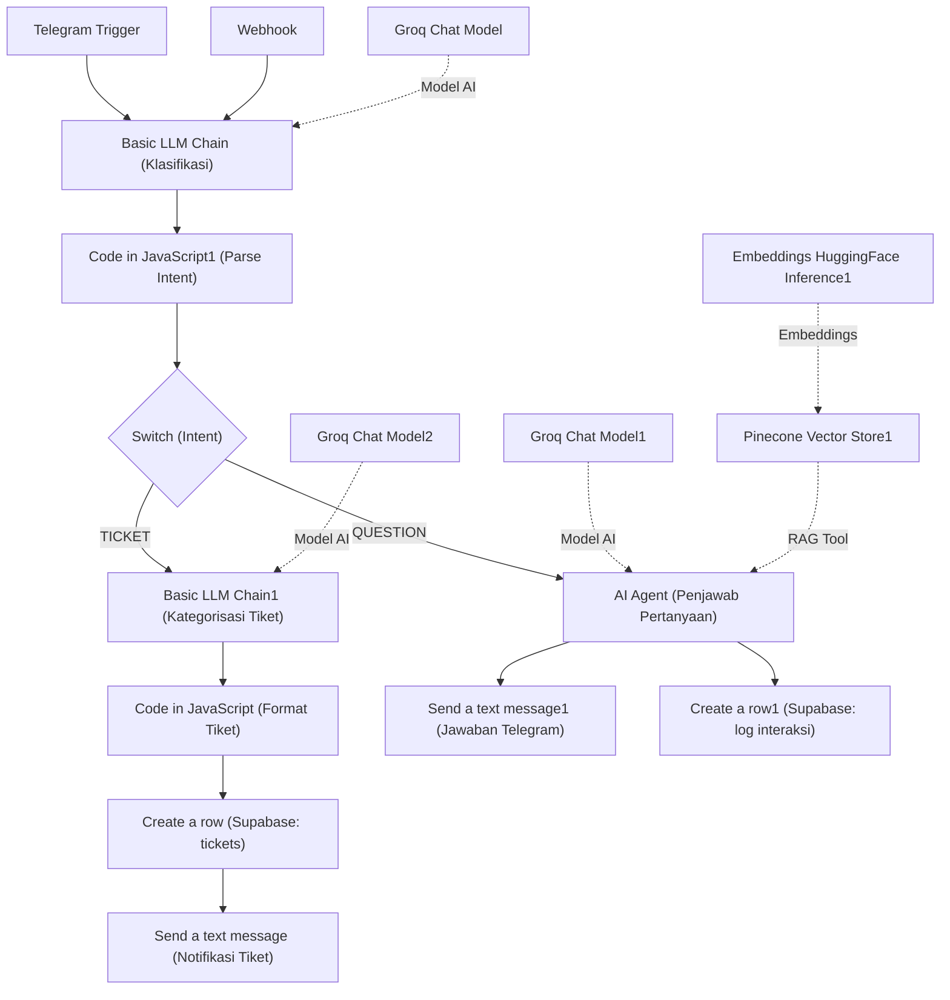

# AI Employee Helpdesk & IT Ticket Routing + RAG (n8n)

## Deskripsi singkat

Workflow n8n untuk assistant IT internal yang menggabungkan Retrieval-Augmented Generation (RAG) dengan Pinecone (vector DB), embeddings (Hugging Face), LLM (Groq), Google Drive untuk sourcing dokumen, dan Supabase untuk ticketing/log.

## Project Workflow



## Fitur utama

- Menjawab pertanyaan karyawan menggunakan dokumen internal (RAG)
- Indexing dokumen Google Drive ke Pinecone (workflow `Set Database Vector`)
- Klasifikasi intent (QUESTION vs TICKET)
- Pembuatan tiket otomatis ke Supabase jika tidak ditemukan jawaban
- Notifikasi via Telegram

## Persyaratan

- n8n
- Pinecone account (index yang direkomendasikan: `it-knowledge-base`)
- Hugging Face API key (embedding model: `sentence-transformers/all-mpnet-base-v2`)
- Groq API key (LLM models digunakan dalam workflow)
- Google Drive OAuth2 (folder dokumentasi)
- Telegram bot token
- Supabase credentials (untuk menyimpan tiket dan log)

## Instalasi & Import

1. Buka n8n → Workflows → Add → Import from File.
2. Pilih file:
   - `AI Employee Helpdesk & IT Ticket Routing + RAG.json`
   - `Set Database Vector.json`
3. Re-bind credential pada setiap node (Pinecone, Hugging Face, Groq, Google Drive, Telegram, Supabase).
4. Untuk workflow `Set Database Vector`, set `folderToWatch` ke folder Google Drive berisi dokumen SOP/FAQ, lalu jalankan sekali atau tunggu trigger.

## Konfigurasi

Set credential / env berikut di n8n atau deployment Anda:

- `PINECONE_API_KEY` — akses ke Pinecone
- `PINECONE_INDEX` — nama index (mis. `it-knowledge-base`)
- `HUGGINGFACE_API_KEY` — untuk membuat embeddings
- `GROQ_API_KEY` — untuk pemanggilan LLM
- `GOOGLE_DRIVE_OAUTH` — untuk mengakses dokumen
- `TELEGRAM_TOKEN` — bot token untuk interaksi
- `SUPABASE_URL`, `SUPABASE_KEY` — untuk menyimpan tiket

## Alur Kerja Singkat

1. `Set Database Vector` (Google Drive Trigger): file baru/terupdate → download → splitter → buat embeddings → upsert ke Pinecone.
2. `AI Employee Helpdesk` (Trigger Telegram / Webhook): terima pertanyaan → klasifikasi intent (QUESTION / TICKET).
   - Jika `QUESTION`: lakukan retrieval top-k dari Pinecone → ringkas sumber → jawab ke user.
   - Jika jawaban tidak ditemukan atau user meminta, buat tiket: generate ID (format `IT-YYYY-XXXX`), simpan di Supabase, kirim notifikasi Telegram.

### Diagram Arsitektur (Mermaid)

```mermaid
flowchart LR
   subgraph Inputs
      TG[Telegram Trigger]
      WH[Webhook]
   end

   TG --> BLL[Basic LLM Chain]
   WH --> BLL

   BLL --> CJ[Code in JavaScript1]
   CJ --> SW[Switch (QUESTION / TICKET)]

   SW -- TICKET --> LLM1[Basic LLM Chain1] --> CJ2[Code in JavaScript] --> SUPA[Create a row (Supabase tickets)] --> TKT[Send a text message (Telegram ticket created)]

   SW -- QUESTION --> GM[Groq Chat Model] --> AGT[AI Agent] --> PINE[Pinecone Vector Store] --> RESP[Send a text message1 & Create a row1]

   subgraph Helpers
      EMB[Embeddings (Hugging Face)] --> PINE
   end
```

### Node & Credential Mapping

- `Telegram Trigger` / `Send a text message` / `Send a text message1`: `telegramApi` — example credential name: "Telegram account"
- `Groq Chat Model` / `Groq Chat Model1` / `Groq Chat Model2`: `groqApi` — "Groq account"
- `Pinecone Vector Store1`: `pineconeApi` — "Pinecone account"
- `Embeddings HuggingFace Inference1`: `huggingFaceApi` — "Hugging Face account"
- `Create a row` / `Create a row1`: `supabaseApi` — "Supabase account 2"

## Contoh Interaksi

- User: "Bagaimana cara reset VPN?"
- Bot: (menjawab dengan ringkasan yang diambil dari dokumentasi jika tersedia) atau
- Bot: "Maaf, saya tidak menemukan informasi. Apakah Anda ingin dibuatkan tiket ke Tim IT?"

## Catatan Indexing & Keamanan

- Jangan index dokumen yang mengandung secrets, kredensial, atau data sensitif.
- Batasi akses Pinecone dan Supabase menggunakan API keys dengan hak minimal.

## File dalam folder

- `AI Employee Helpdesk & IT Ticket Routing + RAG.json` — workflow utama
- `Set Database Vector.json` — workflow untuk membuat / memperbarui vector DB
- `Readme.MD` — dokumentasi ini

## Lisensi

Default: MIT (sesuaikan jika perlu)
