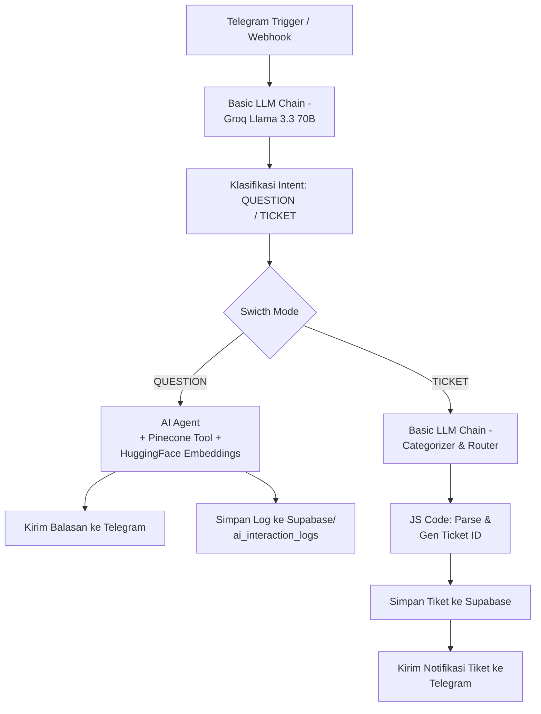
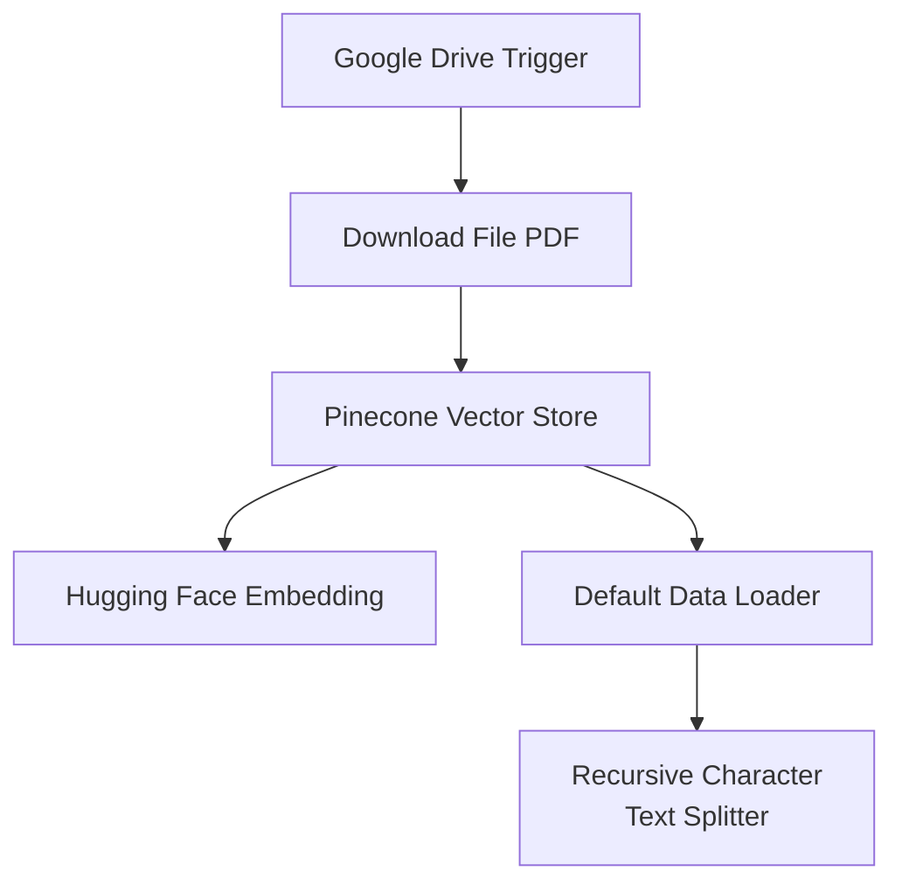

# AI Employee Helpdesk & IT Ticket Routing + RAG System

Sistem **AI Employee Helpdesk** berbasis **n8n**, **Groq (Llama 3)**, **Pinecone Vector Database**, dan **Supabase**. Sistem ini dirancang untuk menangani pesan masuk dari pengguna via **Telegram Bot**, mengklasifikasikan niat pengguna (*Intent Classification*), menjawab pertanyaan seputar kebijakan/SOP IT internal menggunakan **RAG (Retrieval-Augmented Generation)**, serta secara otomatis membuat dan merouting tiket gangguan ke tim IT terkait.

---

## 🛠️ Fitur Utama

1. **AI Dispatcher & Intent Classification**:
   - Memilih jalur antara **QUESTION** (Pertanyaan/Panduan) dan **TICKET** (Laporan Masalah/Permintaan Akses).
2. **RAG-Powered AI Agent (Helpdesk Knowledge Base)**:
   - Mencari jawaban langsung dari basis pengetahuan internal yang tersimpan di Pinecone Vector Database (`it-knowledge-base`).
   - Sumber kebenaran tunggal (*Source of Truth*) dari dokumen PDF IT yang diunggah.
3. **Automated Ticket Classification & Routing**:
   - Mengkategorikan masalah (*Hardware, Software, Network, Access Request, Security*).
   - Menentukan prioritas (*P1 - Critical, P2 - High, P3 - Medium, P4 - Low*).
   - Menyarankan tindakan awal (*Troubleshooting Step*) dan menentukan tim yang bertanggung jawab.
   - Format ID Tiket Otomatis: `IT-YYYY-XXXX`.
4. **Database & Logging**:
   - Menyimpan tiket aktif dan riwayat percakapan AI secara real-time ke **Supabase**.
5. **Auto Indexing / Knowledge Ingestion**:
   - Memicu pembaruan basis pengetahuan otomatis dari Google Drive ke Pinecone saat ada perubahan file PDF.

---

## 🏗️ Arsitektur & Diagram Alur Workflows

Proyek ini terdiri dari **2 Workflow Utama n8n** dan **1 File Basis Pengetahuan**:

### 1. Workflow Utama (`AI Employee Helpdesk & IT Ticket Routing + RAG.json`)


### 2. Workflow Ingest Vector (`Set Database Vector.json`)


---

## 📁 Struktur File Proyek

```text
.
├── AI Employee Helpdesk & IT Ticket Routing + RAG.json  # Workflow utama Helpdesk, Routing, & RAG
├── Set Database Vector.json                             # Workflow otomatisasi vectorization ke Pinecone
├── 📚 IT KNOWLEDGE BASE.pdf                             # Dokumen SOP, Kebijakan, & Panduan IT
└── README.md                                             # Dokumentasi proyek
```

---

## 📄 File Knowledge Base (Dokumen PDF)

Dokumen **Knowledge Base PDF** berfungsi sebagai *Source of Truth* untuk AI Agent. Dokumen ini memuat panduan operasional IT internal, antara lain:
* **Akses & Jaringan**: Panduan koneksi VPN, Wi-Fi kantor, & reset password.
* **Pengajuan Akses**: Prosedur permintaan akun GitLab, Server, & Database.
* **Perangkat & Perhitungan Troubleshooting**: Penanganan masalah Printer, Laptop, & Software Bug.
* **SOP & Aturan IT Internal**: Aturan penggunaan fasilitas IT perusahaan.

---

## 🚀 Panduan Setup & Instalasi

### 1. Prasyarat (Prerequisites)
* **n8n** (Self-hosted / Cloud)
* Akun **Telegram Bot** (dibuat via `@BotFather`)
* Akun **Groq API**
* Akun **Pinecone** (Buat index bernama `it-knowledge-base`)
* Akun **Hugging Face** (Inference API)
* Akun **Supabase**
* Akun **Google Cloud / Google Drive**

---

### 2. Konfigurasi Database Supabase

Buat dua tabel di Supabase dengan skema berikut:

#### Tabel `tickets`
```sql
CREATE TABLE tickets (
    id BIGSERIAL PRIMARY KEY,
    ticket_id VARCHAR(50) NOT NULL,
    telegram_chat_id BIGINT,
    raw_issue TEXT,
    category VARCHAR(50),
    priority VARCHAR(10),
    summary TEXT,
    suggested_action TEXT,
    assigned_team VARCHAR(100),
    status VARCHAR(20) DEFAULT 'OPEN',
    created_at TIMESTAMP WITH TIME ZONE DEFAULT CURRENT_TIMESTAMP
);
```

#### Tabel `ai_interaction_logs`
```sql
CREATE TABLE ai_interaction_logs (
    id BIGSERIAL PRIMARY KEY,
    telegram_chat_id BIGINT,
    intent VARCHAR(20),
    user_query TEXT,
    ai_response TEXT,
    created_at TIMESTAMP WITH TIME ZONE DEFAULT CURRENT_TIMESTAMP
);
```

---

### 3. Import Workflow ke n8n

1. Buka dashboard **n8n**.
2. Pilih **Workflows** > **Import from File**.
3. Import kedua file JSON:
   - `Set Database Vector.json`
   - `AI Employee Helpdesk & IT Ticket Routing + RAG.json`

---

### 4. Setup Credentials di n8n

Pastikan untuk mengonfigurasi credential berikut pada node terkait di n8n:
- **Telegram API**: Token Bot Telegram Anda.
- **Groq API**: API Key Groq Anda.
- **Pinecone API**: API Key & Environment Pinecone.
- **Hugging Face API**: Access Token Hugging Face (`sentence-transformers/all-mpnet-base-v2`).
- **Supabase API**: URL & Service Role / Anon Key Supabase.
- **Google Drive OAuth2 API**: Akses ke folder penyimpanan PDF Knowledge Base.

---

## ⚡ Cara Kerja System (Workflow Steps)

### A. Pengisian Vector Database
1. Unggah file `Knowledge_Base_IT.pdf` ke folder Google Drive yang dipantau.
2. Workflow `Set Database Vector` akan secara otomatis mengunduh file PDF tersebut, memecah teks (*Chunking* 800 karakter), membuat vector embedding via Hugging Face, dan menyimpannya ke **Pinecone Vector Store**.

### B. Penanganan Pesan Masuk
1. Pengguna mengirimkan pesan via Telegram.
2. **AI Dispatcher** mengklasifikasikan pesan:
   - **QUESTION**: AI Agent mencari jawaban dari Pinecone. Jika ditemukan, AI menjawab sesuai dokumentasi. Jika tidak, AI menyarankan pembuatan tiket.
   - **TICKET**: AI Router mengkategorikan tiket, menentukan prioritas & tim terkait, menyimpan tiket ke Supabase, dan mengirimkan konfirmasi ID Tiket ke pengguna.

---

## 📝 Lisensi & Kontribusi

Proyek ini dibuat untuk kebutuhan internal IT Service Management (ITSM). Bebas disesuaikan untuk skala industri atau portofolio AI/ML Engineering.
